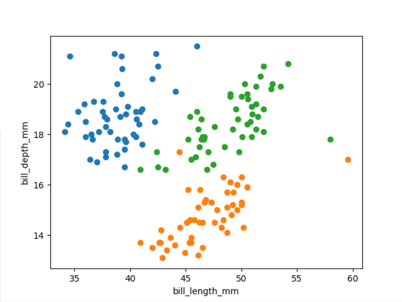

# Task 1 Report

## Team ID: CS_H21

## Team Members:

| IDS         | Names                  |
| ----------- | ---------------------- |
| 20191700109 | اسلام عصام عبد العاطى  |
| 20191700062 | احمد محمد توفيق        |
| 20191700085 | ادهم على احمد          |
| 20191700141 | اميره ياسر محمد عطيه   |
| 20191700159 | ايمان منصور عبد الحليم |

## The visualization of dataset:

bill_length_mm and bill_depth_mm are discriminative between all 3 classes.

---

bill_length_mm and flipper_length_mm are discriminative between all 3 classes.

---

bill_length_mm and body_mass_g are discriminative between Chinstrap and Adelie or Chinstrap and Gentoo.

---

bill_depth_mm and flipper_length_mm are discriminative between Gentoo and Adelie or Gentoo and Chinstrap.

---

bill_depth_mm and gender are discriminative between Gentoo and Adelie or Gentoo and Chinstrap.

---

bill_depth_mm and body_mass_g are discriminative between Gentoo and Adelie or Gentoo and Chinstrap.

---

flipper_length_mm and gender are discriminative between Gentoo and Adelie or Gentoo and Chinstrap.

---

flipper_length_mm and body_mass_g are discriminative between Gentoo and Adelie or Gentoo and Chinstrap.

---

gender and body_mass_g are discriminative between Gentoo and Adelie or Gentoo and Chinstrap.

---

## Training With Adelie And Gentoo:

Accuracy : 0.975

---

Accuracy : 0.5

---

Accuracy : 0.5

---

Accuracy : 0.5

---

Accuracy : 0.975

---

Accuracy : 0.5

---

Accuracy : 0.5

---

Accuracy : 0.5

---

Accuracy : 0.5

---

Accuracy : 0.5

---

## Training With Adelie And Chinstrap:

Accuracy : 1.0

---

Accuracy : 0.525

---

Accuracy : 0.5

---

Accuracy : 0.5

---

Accuracy : 0.5

---

Accuracy : 0.5

---

Accuracy : 0.5

---

Accuracy : 0.5

---

Accuracy : 0.5

---

Accuracy : 0.5

---

## Training With Chinstrap And Gentoo:

Accuracy : 0.525

---

Accuracy : 0.525

---

Accuracy : 0.525

---

Accuracy : 0.525

---

Accuracy : 0.975

---

Accuracy : 0.75

---

Accuracy : 0.5

---

Accuracy : 0.5

---

Accuracy : 0.5

---

Accuracy : 0.5

---

### Best 2 Features To Train Adelie With Gentoo : bill_length_mm with bill_depth_mm and flipper_length_mm with bill_depth_mm.

### Best 2 features To Train Chinstrap And Gentoo : flipper_length_mm with bill_depth_mm.

### Best 2 features To Adelie And Chinstrap : bill_length_mm with bill_depth_mm.

### While Training With Adelie And Chinstrap Features bill_length_mm with bill_depth_mm made the highest Accuracy = 1.
